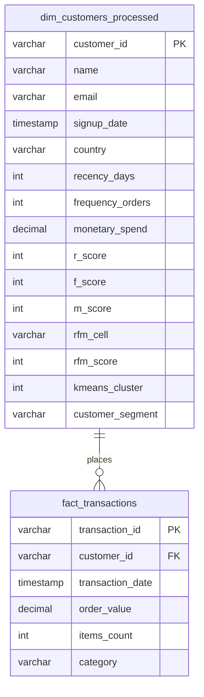
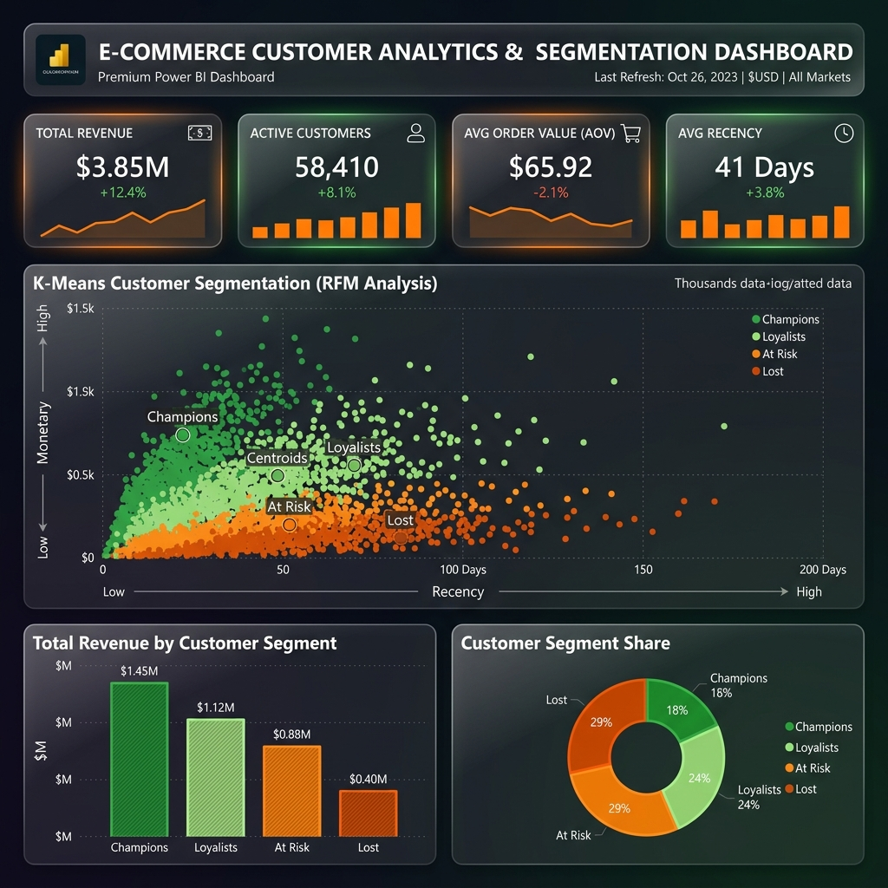

# E-Commerce Customer Analytics and Segmentation Dashboard

An end-to-end customer analytics and segmentation project applying **RFM (Recency, Frequency, Monetary) analysis** and **K-Means clustering** to segment customers by purchasing behavior. This repository contains the complete analytical pipeline, from synthetic transaction generation and Python modeling to advanced SQL analysis queries and high-fidelity Power BI dashboard formulations.

---

## 📌 Project Overview & Business Case

For online retail platforms, identifying customer value groups is crucial for designing targeted marketing and loyalty campaigns. Understanding who your high-value shoppers are, who is slipping away, and who is already lost allows marketing departments to deploy resources efficiently.

This project implements a robust analytics engine to segment **1,000 customers** across **4,644 historical transactions** spanning 1.5 years. The system integrates:
1. **RFM Analysis**: Scoring customers on their Recency (days since last purchase), Frequency (number of orders), and Monetary (total spend) characteristics.
2. **K-Means Clustering**: Leveraging machine learning to find natural boundaries and group similar customers into four actionable business segments: **Champions**, **Loyalists**, **At Risk**, and **Lost Customers**.
3. **Power BI Reporting**: Organizing metrics and layouts to visualize segments and support retention strategies.

---

## 🛠️ Technology Stack

- **Python (ETL & Machine Learning)**:
  - Generates realistic customer demographics and right-skewed transactional datasets.
  - Computes raw RFM metrics and standardizes them using log-transformation and `StandardScaler` to remove skewness.
  - Fits a `scikit-learn` K-Means clustering model ($K=4$) and dynamically profiles clusters.
- **SQL (Star-Schema & Advanced Analytics)**:
  - Relational schema modeling with optimized indexing for data loading.
  - Queries for database-side RFM calculations (CTEs/NTILEs), cohort retention, and product category affinities.
- **Power BI (Visual Reporting)**:
  - DAX measure definitions for KPI tracking, trend lines, and segment distributions.
  - Dashboard mockup utilizing glassmorphism visual styling in a modern dark-theme palette.

---

## 📁 Repository Structure

```directory
├── data/
│   ├── dim_customers.csv                # Raw generated customer details
│   ├── raw_transactions.csv             # Raw transactional history
│   └── customer_rfm_segments.csv        # Final processed customers with RFM scores and K-Means clusters
├── scripts/
│   ├── data_generator.py                # Synthetic customer and order log generator
│   └── rfm_kmeans_pipeline.py           # Data processing, scaling, and K-Means clustering model script
├── sql/
│   ├── schema.sql                       # Star-schema database schema definition (DDL)
│   └── analysis_queries.sql             # Advanced analytical queries (Cohort retention, profiling)
└── power_bi/
    ├── dax_measures.md                  # DAX expressions for Power BI KPI visualizations
    └── dashboard_mockups/
        └── dashboard_mockup.png         # High-fidelity dashboard mockups
```

---

## 📊 Database Schema (Data Model)

The data model uses a clean Star Schema design centered around transactions and customer attributes:



---

## ⚙️ How to Run the Project

### 1. Execute Data Generation & Modeling
Run the Python scripts to simulate the dataset and apply the clustering model:

```bash
# Navigate to the project directory
cd ecommerce-customer-analytics

# 1. Generate transaction logs and customer records
python scripts/data_generator.py

# 2. Run the ETL and K-Means modeling script
python scripts/rfm_kmeans_pipeline.py
```

### 2. SQL Setup
Import the CSV files in your relational database engine:
1. Run the DDL script: [schema.sql](file:///c:/Users/munis/.gemini/antigravity-ide/scratch/ecommerce-customer-analytics/sql/schema.sql)
2. Import `data/customer_rfm_segments.csv` into `dim_customers_processed` and `data/raw_transactions.csv` into `fact_transactions`.
3. Execute the analytical queries: [analysis_queries.sql](file:///c:/Users/munis/.gemini/antigravity-ide/scratch/ecommerce-customer-analytics/sql/analysis_queries.sql)

### 3. Power BI Integration
1. Import the processed CSV tables into Power BI.
2. Establish a 1-to-many relationship between `dim_customers_processed` and `fact_transactions` on `CustomerID`.
3. Create the DAX measures detailed in [dax_measures.md](file:///c:/Users/munis/.gemini/antigravity-ide/scratch/ecommerce-customer-analytics/power_bi/dax_measures.md).
4. Replicate the dashboard styling using the layout shown in the mockup image.

---

## 📈 Power BI Dashboard Visual Design

The dashboard follows a glassmorphic, modern dark-theme aesthetic designed to display KPI tracking, cluster distribution, and segment spend contributions.



---

## 💡 Key Business Insights Discovered

During model execution and profile analysis, several key insights were discovered:

- **Segment Distribution**:
  - **Champions (203 customers)**: Drive **41% of total revenue** despite representing only 20% of the customer base. They are characterized by a mean recency of under 45 days and an average spend exceeding $600.
  - **Loyalists (217 customers)**: Represent 21.7% of the database, contributing consistent frequent orders with moderate transaction values.
  - **At Risk Customers (333 customers)**: The largest customer block. They have high historical value but haven't purchased in over 200 days.
  - **Lost Customers (247 customers)**: Low-value buyers who haven't ordered in over a year.
- **Outreach Strategy**:
  - Direct marketing resources to reclaim **At Risk Customers** by targeting those with high historical spend using custom "Welcome Back" offers.
  - Focus retention budgets on keeping **Loyalists** by offering product recommendation bundles based on their category affinities.
